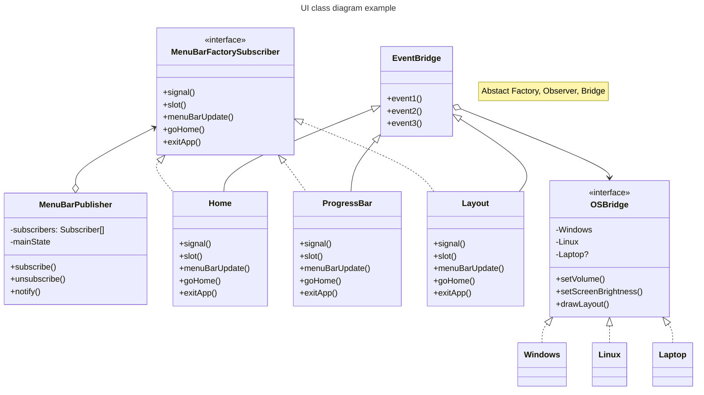
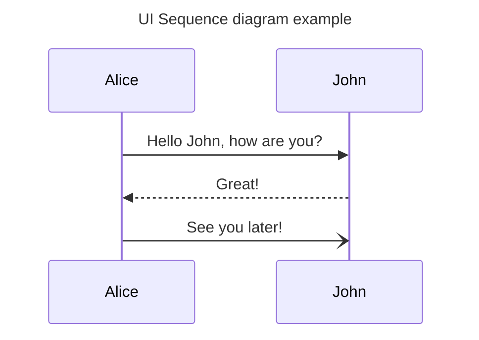

# Qt library practice(pronounced as "cute")
## Purpose
What needs : Qt C++ library  
Help for : myself  
How to achieve : write a lot of useful qt code
## Dependencies
GNU/Linux 20.04
```
sudo apt-get install \
qtcreator \
qt5-default \
libcurl4-openssl-dev
```
## Build
```
qt_ws$ mkdir build
qt_ws$ cd build
qt_ws/build$ cmake ..
qt_ws/build$ cmake --build .
```
## Run
### Launch
```
qt_ws/build$ ./qt
```
### Test

## Debug
with gdb(GNU Debugger)  
- After built  
`qt_ws$ cd build`  
`qt_ws/build$ cmake -DCMAKE_BUILD_TYPE=Debug ..` or (better for full debugging)  
`qt_ws/build$ cmake -DCMAKE_BUILD_TYPE=RelWithDebInfo ..` or  
`qt_ws/build$ cmake ..` (because the option is already set in CmakeLists.txt)  
`qt_ws/build$ gdb ./qt` to start the gdb  
(enter)  
`(gdb) info sources -dirname qt_ws` to filter and to find sources in the program  
`(gdb) b .../qt_ws/src/main.cpp:10` to set a breakpoint  
`(gdb) r` to run the program  
`(gdb) n or s` to continue to the next line  

## Patterns
With the UI implementations, MVC would be [good](https://stackoverflow.com/questions/9419147/which-software-design-patterns-do-common-gui-frameworks-exhibit). Frontend-Backend.  
So, combination of below.  
### Creational Design Pattern
- Abstract Factory
### Structural Design Pattern
- **Bridge**
### Behavioral Design Pattern
- Observer
## Diagrams
### Class Diagram

### Sequence Diagram

## Development notes
- An email can be sent through ubuntu terminal.
  - [https://stackoverflow.com/questions/70730838/how-to-send-email-with-gmail-using-curl-in-c](https://stackoverflow.com/questions/70730838/how-to-send-email-with-gmail-using-curl-in-c)
- An email will be sent via the google SMTP server. A google account with app password are needed. [You need to set](https://support.google.com/mail/answer/185833?hl=en)
  1. 2-Step Verification 
  2. App password
   
  The App password will be used for the curl command.

## References
- [Relationship between Qwidget and Qlayout](https://stackoverflow.com/questions/24262564/convert-between-qlayout-and-qwidget)